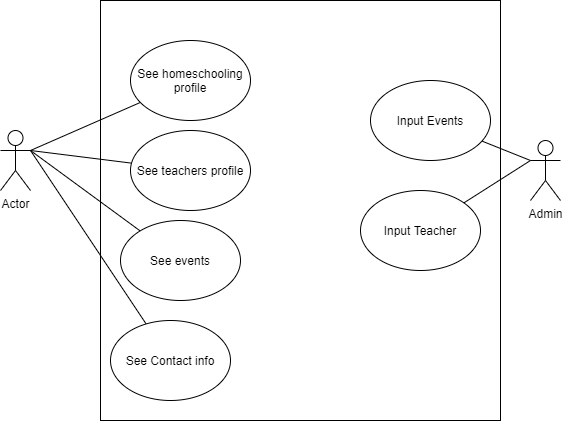
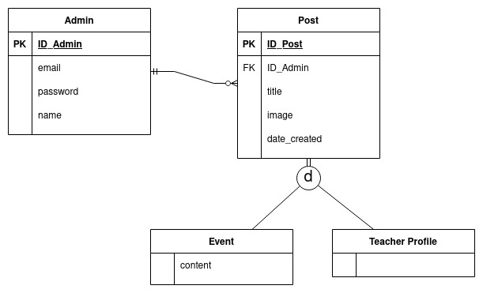

<h1 align="center">Expand Popularity Homeschooling M.T.KITA</h1>

Projek membuat website untuk Homeschooling M.T.KITA untuk meningkatkan popularitas

| [Deskripsi Singkat](#deskripsi-singkat) | [Project Scope](#project-scope) | [Milestones](#milestones) | [Feature](#feature) | [Technology](#technology) | [Tools](#tools) | [Hasil dan Implementasi](#hasil-dan-implementasi) | [Developer dan Jobdesc](#developer-dan-jobdesc) |
| :-------------------------------------: | :-----------------------------: | :-----------------------: | :-----------------: | :-----------------------: | :-------------: | :-----------------------------------------------: | :---------------------------------------------: | 

## Deskripsi Singkat

[`^ kembali ke atas ^`](#)

Sistem aplikasi web yang berfungsi untuk memberikan informasi yang dibutuhkan seorang calon pendaftar untuk mengetahui dan mendaftar pada tempat les HomeSchooling Aula M.T. KITA. Aplikasi ini memberikan informasi mengenai informasi umum, profil guru serta event-event mengenai HomeSchooling Aula M.T KITA.

## Project Scope 

[`^ kembali ke atas ^`](#)

- Memperluas cakupan pelanggan les
- Memaparkan informasi lengkap tentang tempat les dan pengajar ke calon pelanggan/pelanggan 
- Calon pelanggan dapat dengan mudah mendapatkan informasi mengenai tempat les
- Pelanggan dan calon pelanggan dapat melihat artikel yang edukatif
- Mempermudah guru dan murid dalam mengakses materi pembelajaran.

## Milestones

[`^ kembali ke atas ^`](#)

| Milestone | to do |
| --------- | ----- |
| Milestone 1 : Pre- Production | Meet with client |
| Milestone 2 : Vertical Slice | Make ertical Slice |
| Milestone 3 : Verify and Finishing | Finalize  |

## Feature

[`^ kembali ke atas ^`](#)

| Feature |
| ------- |
| Landing Page |
| Home Page|
| About Us Page |
| Teacher Page |
| Event Page |
| Contact Info |
| Input Event |
| Edit Event |
| Delete Event |
| Input Teacher |
| Edit Teacher |
| Delete Teacher |

## Technology

[`^ kembali ke atas ^`](#)

| Technology |
| ---------- |
| Laravel |
| Bootstrap |
| TailwindCss |
| PhpMyadmin |
| GitHub |

## Tools

[`^ kembali ke atas ^`](#)

| Tools |
| ----- |
| Notion |
| Figma |
| Google Drive |

## hasil-dan-implementasi

[`^ kembali ke atas ^`](#)

## Developer dan Jobdesc

[`^ kembali ke atas ^`](#)
| Nama | NIM | Role |
| --------------------- | --------- | --------- |
| Luthfi Fachruddin | G64180025 | DevOps & Front-end |
| Alfian Arief Santoso | G64180061 | Front-end & UX |
| Pradhiptha Trimanggala Satya | G64180075 | DevOps & Back-end |
| Fathi Annaufal Soblia | G64180094 | UI/UX & Product Manager |

